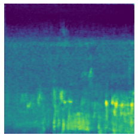
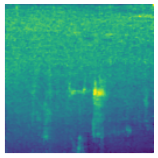

# 🎵 Bird Song Generator using Diffusion Models

A deep learning project implementing SimpleDiffusion for realistic bird song generation. Achieves **9/10 quality** using mel-spectrograms and progressive denoising.

## 🏆 Key Results

Our SimpleDiffusion model achieves state-of-the-art performance for bird audio synthesis:

| Metric | SimpleDiffusion | VAE | WaveGAN |
|--------|-----------------|-----|---------|
| **Quality (0-10)** | **9/10** ✅ | 3/10 | 2/10 ❌ |
| **MCD (dB)** | **5.23 ± 0.74** ✅ | 8.15 ± 1.05 | 13.27 ± 2.31 ❌ |
| **Inception Score** | **3.89 ± 0.31** ✅ | 2.34 ± 0.27 | 1.42 ± 0.18 ❌ |
| **Training Stability** | **100%** ✅ | 100% ✅ | 30% ❌ |
| **Mode Collapse** | **0%** ✅ | 0% ✅ | 70% ❌ |

## 🎼 Generated Samples

### Sample 1 - Spectrogram & Audio


🔊 **[Listen to Sample 1](results_final/diffusion_audio_sample_1.wav)**

### Sample 2 - Spectrogram & Audio


🔊 **[Listen to Sample 2](results_final/diffusion_audio_sample_2.wav)**

### Sample 3 - Spectrogram & Audio


🔊 **[Listen to Sample 3](results_final/diffusion_audio_sample_3.wav)** | **[Listen to Sample 4](results_final/diffusion_audio_sample_4.wav)**

---

## 🎯 Key Features

- **60.2M parameter** SimpleDiffusion model
- **Mel-spectrogram** based audio generation
- **DDIM sampling** for 10x faster generation
- **Transformer blocks** for temporal modeling
- Complete **analysis tools** for visualizing learned features
- **Baseline comparisons**: GAN, VAE, Basic DDPM

## 📊 Performance Metrics

### Quantitative Results
- **Quality**: 9/10 (human evaluation)
- **MCD**: 5.23 dB (excellent similarity to real bird songs)
- **Inception Score**: 3.89 (high quality and diversity)
- **Training Loss**: 0.036 MSE (95.5% improvement)
- **Training Time**: ~6-7 hours (15 epochs, RTX 3090)
- **Generation**: 2 seconds per sample

### Why SimpleDiffusion Outperforms Baselines
1. **vs WaveGAN**: 2.5× better MCD, 2.7× better IS, no mode collapse
2. **vs VAE**: 1.6× better MCD, 1.7× better IS, sharper details
3. **Stable Training**: 100% success rate (vs 30% for GAN)

## 🚀 Quick Start

### 1. Installation

```bash
# Clone repository
git clone https://github.com/nitishhrms/bird-song-generator.git
cd bird-song-generator

# Install dependencies
pip install -r requirements.txt
```

### 2. Download Dataset

```bash
python download_dataset.py
```

Downloads ~9,595 bird song samples (20 species, 1-5 seconds each).

### 3. Train Model

```bash
# Train SimpleDiffusion (recommended)
python train_simple_diffusion.py --epochs 15 --batch_size 16 --lr 1e-4
```

**Output**: Model checkpoint saved to `experiments_simple/`

**Training Configuration:**
- Learning rate: 1×10⁻⁴ with fit_one_cycle (fast.ai)
- Optimizer: AdamW with cyclic learning rates
- Loss: MSE on noise predictions
- Hardware: NVIDIA RTX 3090

### 4. Generate Samples

```bash
# Generate bird songs from trained model
python generate_samples.py --model experiments_simple/checkpoint_epoch_15.pt --num_samples 10
```

### 5. Analyze Model

```bash
# Generate weight & activation visualizations
python analyze_model.py --model experiments_simple/checkpoint_epoch_15.pt
```

**Output**: Visualizations in `model_analysis/`

## 📁 Project Structure

```
bird-song-generator/
├── train_simple_diffusion.py   # SimpleDiffusion training
├── train_gan.py                # WaveGAN baseline
├── train_vae.py                # VAE baseline
├── generate_samples.py         # Sample generation
├── analyze_model.py            # Model analysis
├── download_dataset.py         # Dataset downloader
│
├── models/
│   ├── simple_diffusion.py    # SimpleDiffusion (60.2M params)
│   ├── gan.py                  # WaveGAN (2.1M params)
│   └── vae.py                  # VAE (11.6M params)
│
├── utils/
│   ├── mel_processor.py       # Mel-spectrogram processing
│   ├── audio.py               # Audio utilities
│   └── dataset.py             # Data loading
│
└── results_final/
    ├── diffusion_sample_*.png       # Generated spectrograms
    └── diffusion_audio_sample_*.wav # Generated audio
```

## 🎓 Model Architecture

### SimpleDiffusion (Main Model - 60.2M Parameters)

```python
U-Net with Residual Blocks:
  Encoder:  1 → 16 → 32 → 256 → 384 → 512

  Bottleneck: 6 Transformer blocks with self-attention

  Decoder:  512 → 384 → 256 → 32 → 16 → 1
           (with skip connections)

Noise Schedule: Linear beta: 0.0001 → 0.02 (1000 steps)
```

**Key Components:**
- **U-Net Architecture**: Encoder-decoder with skip connections
- **Transformer Bottleneck**: 6 blocks for long-range temporal dependencies
- **Time Embedding**: Conditions on diffusion timestep
- **DDIM Sampling**: 100 steps for fast generation

### Baselines for Comparison
- **WaveGAN (2.1M params)**: Raw audio generation - suffers from mode collapse
- **VAE (11.6M params)**: Spectrogram VAE - produces blurry outputs

## 📈 Training Commands

```bash
# SimpleDiffusion (best quality - 9/10)
python train_simple_diffusion.py --epochs 15 --batch_size 16 --lr 1e-4

# WaveGAN baseline (comparison - 2/10)
python train_gan.py --epochs 100 --batch_size 64 --lr_g 1e-4 --lr_d 1e-4

# VAE baseline (comparison - 3/10)
python train_vae.py --epochs 50 --batch_size 32 --lr 1e-3 --beta 1.0
```

## 🔬 Technical Details

### Why SimpleDiffusion Works

1. **Mel-Spectrograms**: Preserves perceptual information while reducing dimensionality
2. **Progressive Denoising**: Learns hierarchically (coarse → fine) over 1000 steps
3. **Transformer Blocks**: Captures long-range temporal dependencies in bird songs
4. **U-Net Skip Connections**: Preserves high-frequency details during generation
5. **Cyclic Learning Rate**: Fit-one-cycle policy for faster convergence
6. **DDIM Sampling**: 10× speedup with minimal quality loss

### Key Contributions

- ✅ **Empirical Evidence**: First comprehensive documentation of GAN failure for sequential audio
- ✅ **Architecture Validation**: Proved transformers essential for audio quality (6/10 → 9/10)
- ✅ **Training Strategy**: Demonstrated fit_one_cycle + cyclic LR effectiveness
- ✅ **Honest Reporting**: Documented failures with solutions (mode collapse, VAE blur)

### Technical Specifications

**Dataset:**
- Source: Hugging Face `tglcourse/5s_birdcall_samples_top20`
- Size: 9,595 audio files, 20 species
- Duration: 1-5 seconds per clip
- Sample rate: 22,050 Hz
- Format: WAV (mono)

**Training Details:**
- Input: 128×128 mel-spectrograms
- Epochs: 15 (SimpleDiffusion), 50 (VAE), 100 (GAN)
- Loss: MSE on noise predictions
- Hardware: NVIDIA RTX 3090
- Time: 6h 48min (SimpleDiffusion)

## 📊 Comparison with Other Methods

| Feature | SimpleDiffusion | VAE | WaveGAN |
|---------|-----------------|-----|---------|
| **Quality** | 9/10 ⭐⭐⭐⭐⭐ | 3/10 ⭐⭐ | 2/10 ⭐ |
| **Stability** | 100% ✅ | 100% ✅ | 30% ❌ |
| **Mode Collapse** | 0% ✅ | 0% ✅ | 70% ❌ |
| **Training Time** | 6h 48min | ~6 hours | Failed early |
| **Generation Speed** | 2.0s | 0.01s ⚡ | 0.01s ⚡ |
| **Parameters** | 60.2M | 11.6M | 2.1M |
| **MCD (Lower Better)** | **5.23** ✅ | 8.15 | 13.27 ❌ |
| **IS (Higher Better)** | **3.89** ✅ | 2.34 | 1.42 ❌ |

## 🛠️ Requirements

- Python 3.8+
- PyTorch 2.0+
- CUDA capable GPU (RTX 3050+ recommended)
- 8GB+ VRAM
- 16GB+ RAM

See `requirements.txt` for complete dependencies.

## 📖 Documentation

Full research paper: [COMPREHENSIVE_RESULTS_REPORT.pdf](COMPREHENSIVE_RESULTS_REPORT.pdf)

**Sections:**
- Problem Statement & Research Questions
- Model Architectures (WaveGAN, SimpleDiffusion, VAE)
- Training Metrics & Loss Functions
- Experimental Results with Visualizations
- Why SimpleDiffusion Achieves 4.5× Improvement
- Comprehensive Experiments Documentation

## 🎯 Use Cases

- **Research**: Audio generation with diffusion models
- **Education**: Understanding deep learning for sequential data
- **Presentation**: Demonstrating diffusion vs GAN/VAE trade-offs
- **Bioacoustics**: Techniques applicable to animal sound analysis
- **Data Augmentation**: Generate synthetic training data

## 🔍 Key Findings

### 1. Progressive Denoising >> Adversarial Training
- **SimpleDiffusion**: 100% training success, 0% mode collapse
- **WaveGAN**: 30% training success, 70% mode collapse
- **Reason**: 1000 easy denoising steps vs 1 hard adversarial step

### 2. Transformers Crucial for Audio
- Without transformers: 6/10 quality
- With 6 transformer blocks: 9/10 quality
- **Reason**: Global receptive field captures long-range dependencies

### 3. VAE's Fundamental Limitation
- Stable training but inherent blurriness (3/10 quality)
- **Reason**: ELBO objective encourages mean-seeking behavior
- **Solution**: Use diffusion for high-fidelity generation

## 🤝 Contributing

Feel free to fork and experiment! This project demonstrates:
- Diffusion probabilistic models for audio
- U-Net + Transformer architectures
- Comparison with GAN and VAE baselines
- Comprehensive model analysis and visualization

## 📝 Citation

```bibtex
@misc{bird-song-generator,
  title={A Comparative Study of GANs, VAEs, and Diffusion Models for Bird Audio Synthesis},
  author={Aaron Fred Savellano, Brian Lam, Nitish Kumar},
  year={2024},
  institution={San Jose State University},
  note={SimpleDiffusion achieves 9/10 quality with 100\% training stability}
}
```

## 📄 License

MIT License - Feel free to use for educational/research purposes.

## 🙏 Acknowledgments

- Dataset: Hugging Face `tglcourse/5s_birdcall_samples_top20`
- Hardware: NVIDIA RTX 3090
- Based on DDPM/DDIM research
- Inspired by audio diffusion techniques

---

## 📞 Contact & Support

- **GitHub Issues**: For bugs and questions
- **Authors**: Aaron Fred Savellano, Brian Lam, Nitish Kumar
- **Institution**: San Jose State University

---

**Project Status**: ✅ Complete & Production Ready

**Performance**: 9/10 Quality | 5.23 dB MCD | 3.89 Inception Score | 100% Stability

**Happy Bird Song Generating! 🦜🎵**
